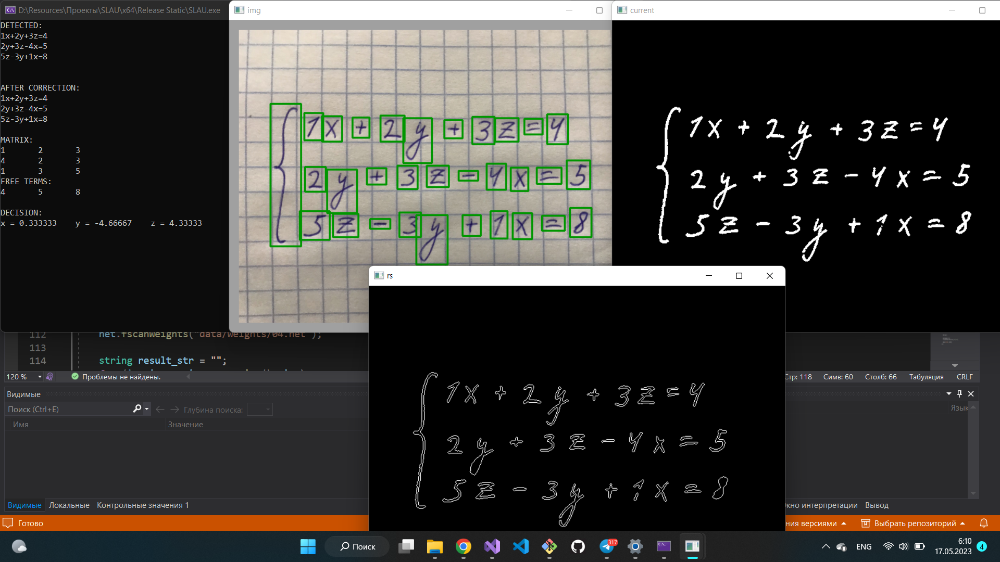

<h1>Решение СЛАУ по фото</h1>
<h2>Задача обнаружения и распознавания (классификации) изображений по признакам изображенных на картинке символов</h2>

Проект не закончен, разработка еще не активно ведется. В процессе разработки были решены следующие задачи:

<ul>
  <li>Обнаружение символов на исходном изображении с помощью библиотеки компьютерного зрения OpenCV (Обработка изображений, работа с цветовыми пространствами, выделение контуров их поиск на исходном изображении)</li>
  <li>Распознавание обнаруженных символов (разработана самописная нейронная сеть (перцептрон), обучаемая с помощью ускоренного градиентного спуска Нестерова)</li>
  <li>Лексический анализ полученной строки распознанных символов (был разработан простенький лексический анализатор)</li>
  <li>Решение полученной СЛАУ прямыми и численными методами</li>
  <li>Разработка GUI</li>
</ul>

GUI предполгается разрабатывать под платформу Android, но пример есть пока что на Windows:

Имеется рабочая консольная версия:

Разработка ведется на языке С++ при использовании библиотеки OpenCV, используемой для обработки изображений. GUI был разработан при использовании библиотеки двухмерной графики SFML.

